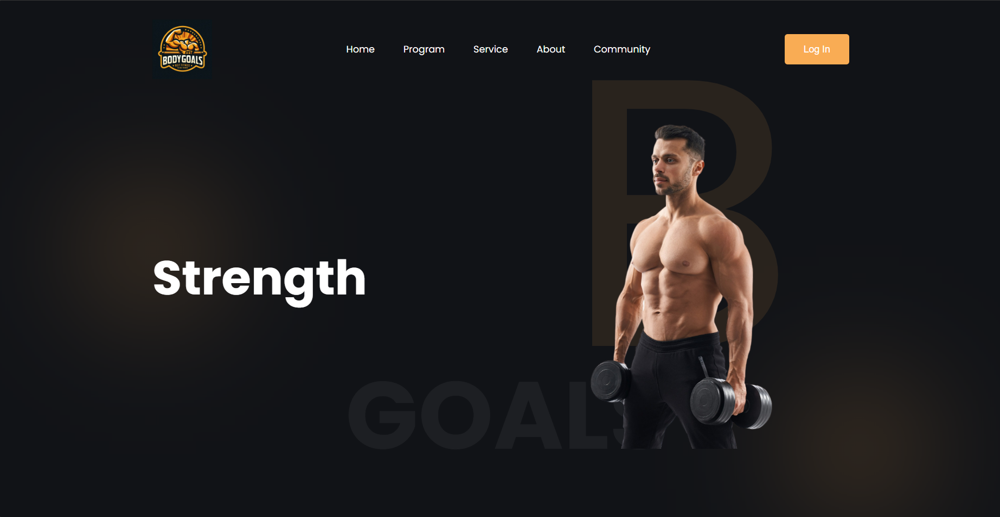
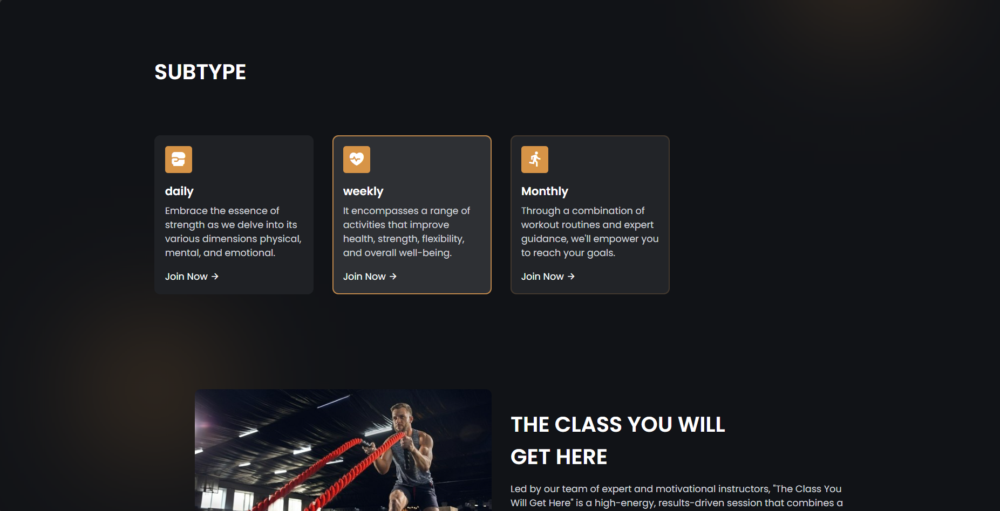
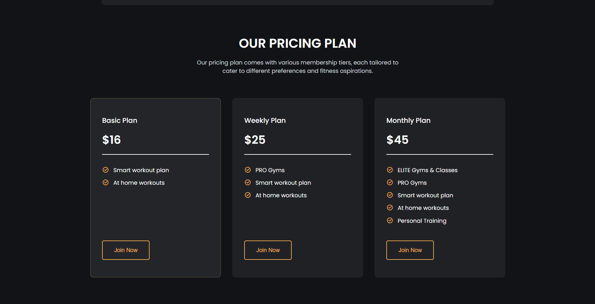
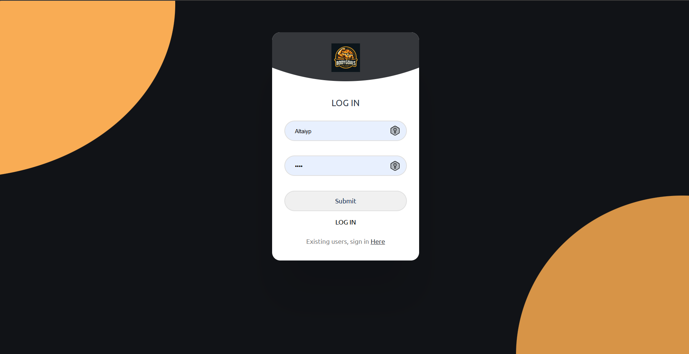
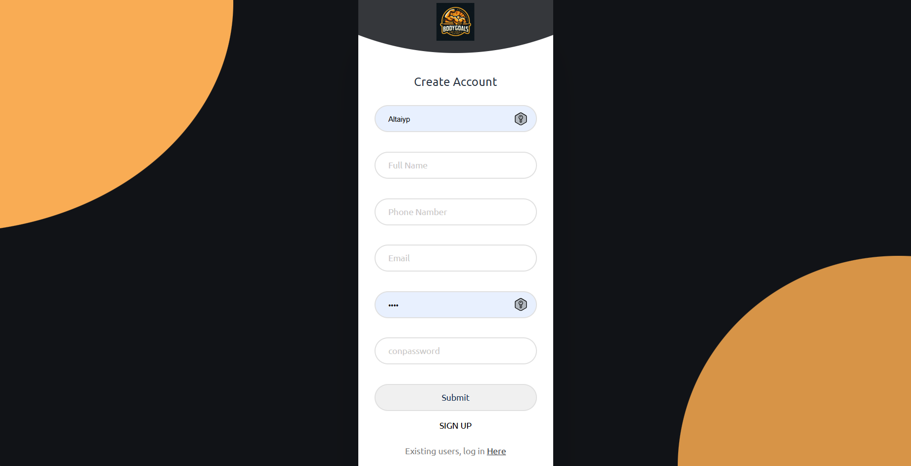

# BODY GOALS WEBSITE 🏋️‍♀️

A modern, high-energy fitness website focused on empowering users to achieve their physical, mental, and emotional strength goals. Whether you're looking for daily motivation or a structured training plan, this platform offers a wide range of programs, expert guidance, and flexible membership options to match your lifestyle.

---

## 🏆 STRENGTH SECTION

**Daily**  
*Embrace the essence of strength as we delve into its various dimensions—physical, mental, and emotional.*

**Weekly**  
*Improve your health, flexibility, and overall well-being with structured, impactful weekly plans.*

**Monthly**  
*Reach your goals with comprehensive workouts and expert-led sessions designed to build lasting results.*

---

## 💪 THE CLASS YOU WILL GET HERE

Led by a team of expert and motivational instructors, this class combines cardio, strength training, and functional fitness exercises to keep you constantly challenged and engaged.

➡️ *Book A Class Today!*

---

## 🤝 WHY JOIN US?

- Friendly and supportive community  
- Motivational atmosphere  
- Expert personal trainers  
- Structured practice sessions  
- Professional gym management  

---

## 💸 OUR PRICING PLAN

We offer three flexible membership tiers designed for every fitness journey:

### 🔹 Basic Plan — $16
- Smart workout plan  
- At-home workouts  

### 🔸 Weekly Plan — $25
- PRO gyms access  
- Smart workout plan  
- At-home workouts  

### 🔶 Monthly Plan — $45
- ELITE gyms & classes  
- PRO gyms access  
- Smart workout plan  
- At-home workouts  
- Personal training sessions  

---

## 🚀 Join Us Today

> Whether you're a beginner or a fitness enthusiast, BODY GOALS WEBSITE provides the tools, trainers, and community you need to succeed.

---

<h2>Screenshots</h2>

  
  

  
  
  

